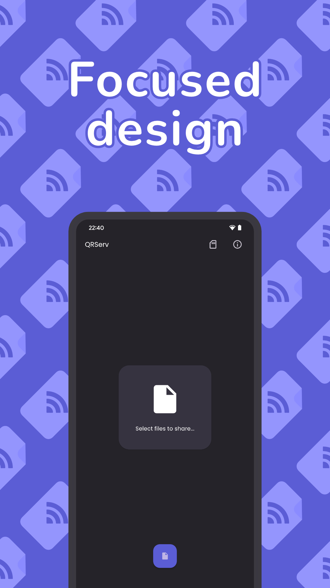
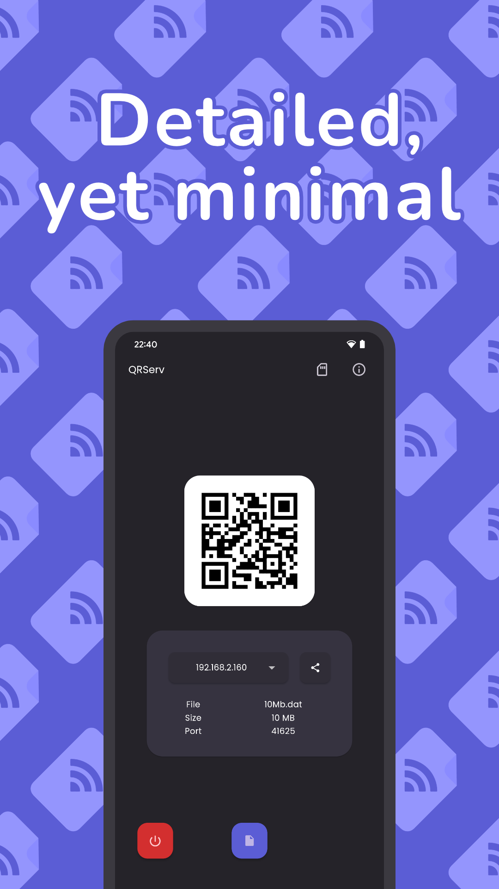
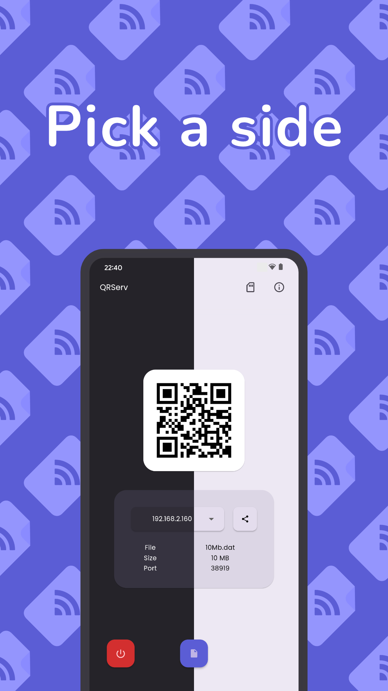
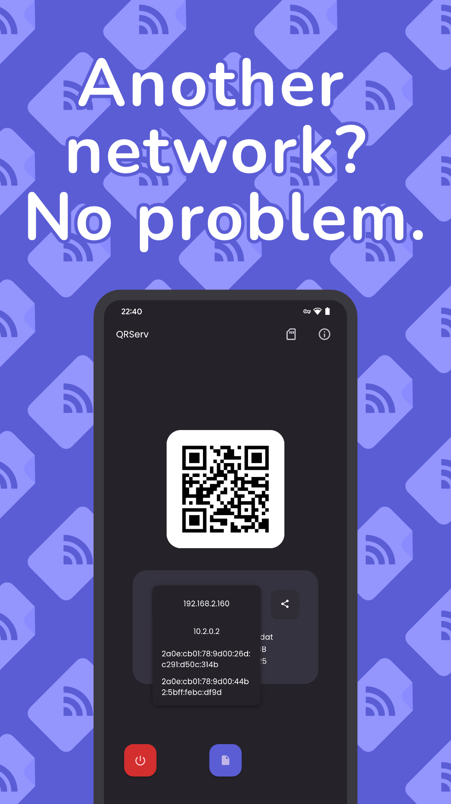
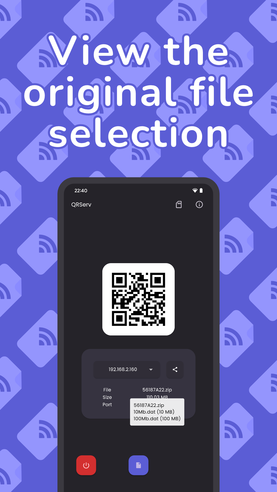
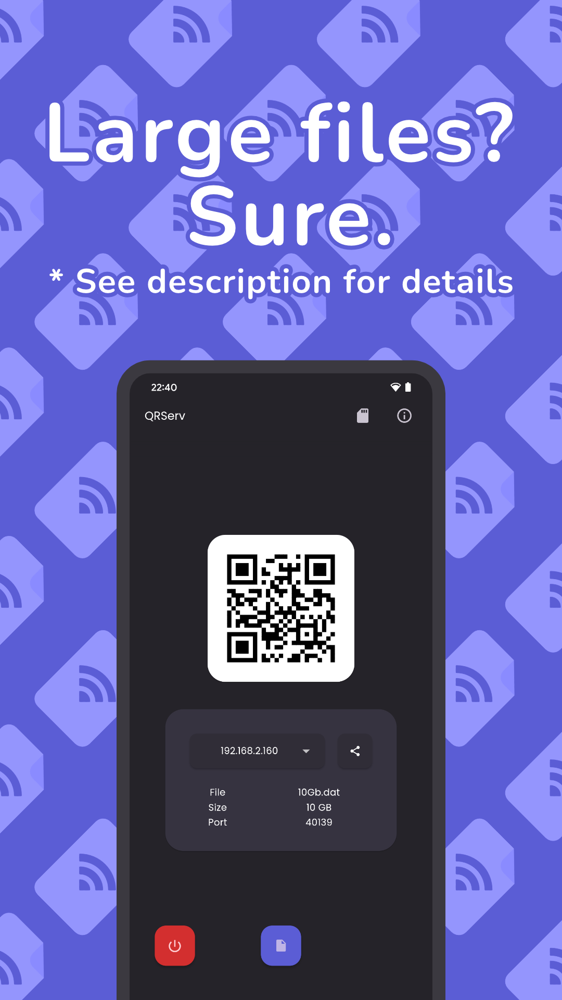

# QRServ

 

    Transfer files with ease over a network.
     
     
    
    &nbsp;&nbsp;
    

    
    &nbsp;&nbsp;&nbsp;&nbsp;
    

    

 

    
Screenshots

     
    

        
        
        
        
        
        
    

 

## About

QRServ is a file sharing application that utilises its own HTTP server to serve files while having a clean & functional user interface.

## Features

- QR Code
    - Tap the QR code to show the URL in a tooltip
    - Press and hold the QR code to copy URL to clipboard
- Share option
- Multi-file selection support
    - Multi-file selection would result in a ZIP archive
        - Tooltip when press and holding on the resulting archive file name will reveal the originally selected files
- Direct Access Mode
    - Available only on Android 10 or earlier on the Play Store version
    - To use this feature on Android 11 or later, use the GitHub version (link is in-app under the 'about' dialog) -- please note that the Play Store version must be uninstalled first as it is signed using a different certificate
    - Large files? Use direct access mode to use direct access to internal storage as to avoid attempting to copy the selection into app cache
    - The file manager for this mode supports only single file selection
    - The mode can be toggled via settings
- File selection removal and modification detection (latter only available with DAM)
- Import via sharesheet
- Show or hide filename in download URL
- Notify when a client requested the hosted file and when that download finishes (includes requestor's IP address)
- Various IP addresses from different network interfaces can be chosen
- HTTP server uses an unused random or user configurable port
- Supports various languages:
    - English
    - French (Français)
    - German (Deutsch)
    - Hungarian (Magyar)
    - Italian (Italiano)
    - Polish (Polski)
    - Portuguese (Português)
    - Spanish (Español)
    - Russian (Русский)
    - Turkish (Türkçe)
    - Persian (فارسی)
    - Hebrew (עברית)

## System Requirements

- **System:** Android
- **Minimum version:** 7.0
- **Architecture:** ARM64

## Releases

Android builds can be found in the [releases](../../releases) section of this repository.

**From version 3.0.0:**

- Builds are ARM64-only
- APK file sizes are much larger
    - This is because native libraries are no longer compressed
    - When installed, the app size will be only a little larger than the APK file itself
    - When using compressed native libraries (as was default in older builds), although the APK file is smaller, the installed size ends up far larger than if it were not compressed

Note: Android builds on GitHub will have a different certificate than builds on the Play Store. In other words, you cannot upgrade a build from installation source A via source B, and vice versa.

### Play Store and GitHub version differences

As you may be aware, there are two different Android builds of this application. This section will cover the differences.

#### Play Store

- Direct Access Mode is **not** available for Android 11 or later due to the `MANAGE_EXTERNAL_STORAGE` runtime permission requirement (see issue #20).
    - In short, Google Play became far stricter about the usage of such sensitive permissions in June 2024.
    - There hasn't been much luck using the MediaStore API-at least with existing Flutter packages that kind of act like wrappers (typically, there are issues and limitations)-so it would likely require writing that functionality from scratch in Kotlin.

#### GitHub

- Direct Access Mode **is** available for all supported Android versions, as `MANAGE_EXTERNAL_STORAGE` can be used to allow support for Android 11 or later.

#### Changing build types

By default, the source code builds the GitHub version. The build type can be changed through the [filemanager.dart](lib/filemanager.dart) file in the `isPlayStoreFriendly` section (instructions can also be found there). Update the permissions in [AndroidManifest.xml](android/app/src/main/AndroidManifest.xml) as appropriate.

### Desktop

The last desktop builds (Windows, Linux) can be found in the [releases section under v1.1.1](../../releases/tag/v1.1.1).

## Contributing

If you are considering contributing to QRServ or reporting issues, more information can be [found here](CONTRIBUTING.md).

## Building

If you wish to have debugging symbols for an app bundle release, ensure you have the Android NDK installed. You may need to specify `ndk.dir` in the `local.properties` file.
 
However, if you do not plan to do a Play Store release, you may remove the `ndk` block from `android.defaultConfig` in the [Gradle build file](android/build.gradle.kts).

## Licenses

Google Play and the Google Play logo are trademarks of Google LLC.

Nunito (the font) is licensed under [OFL-1.1](fonts/OFL.txt).

QRServ is licensed under the [MIT license](LICENSE).

## Translations and translators

New and existing translations are very welcome via issue, pull request, or even email. Credit will be given unless opted out.

Thanks to the following users for helping with language translation:

| User                                         | Language(s) |
| -------------------------------------------- | ----------- |
| [miklosakos](https://github.com/miklosakos)  | Hungarian   |
| [MrRocketFX](https://twitter.com/MrRocketFX) | Polish      |
| [utf-4096](https://github.com/utf-4096)      | French      |
| [SimoneG97](https://github.com/SimoneG97)    | Italian     |
| [guidov2006](https://github.com/guidov2006)  | Spanish     |
| [SapphicMoe](https://github.com/SapphicMoe)  | Russian     |
| [metezd](https://github.com/metezd)          | Turkish     |
| princessmortix                               | Portuguese  |
| [alr86](https://github.com/alr86)            | Persian     |
| [vhhhl](https://github.com/vhhhl)            | German      |
| [elid34](https://github.com/elid34)          | Hebrew      |
