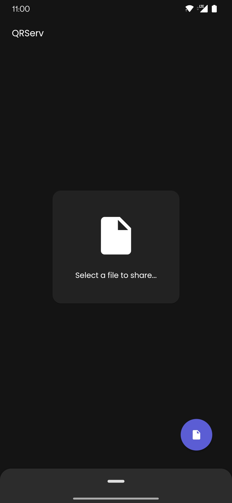
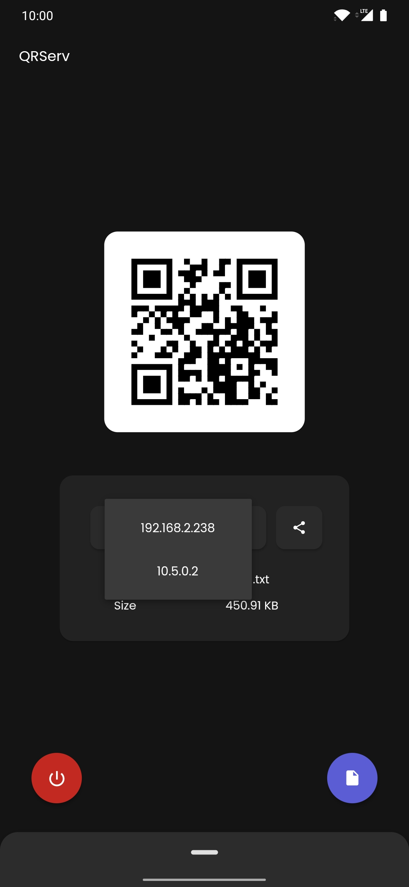
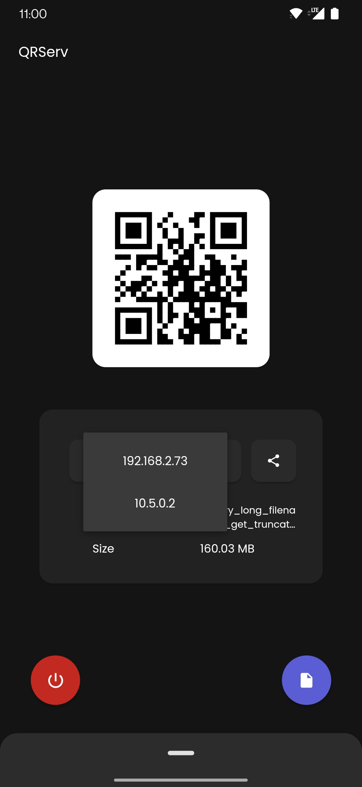

# QRServ

**NOTE:** THIS IS PRE-RELEASE SOFTWARE. PLEASE WAIT FOR IT TO BE FINALISED BEFORE USE (ETA: WITHIN THIS MONTH). OFFICIALLY COMPILED BUILDS ARE UNAVAILABLE FOR PUBLIC DURING THIS TIME.

Transfer files with ease over a network.

[Play Store badge...]&nbsp;&nbsp;&nbsp;&nbsp;

 

    
Screenshots

     
    
    &nbsp;&nbsp;
    
    &nbsp;&nbsp;
    

 

## About

QRServ is a file sharing application that utilises its own HTTP server to serve files while having a clean & functional user interface.

## Features

- QR Code
- Various IP addresses from different network interfaces can be chosen
- HTTP server uses an unused ("random") port
- Animated user experience
- Supports Android and Windows platforms
- Supports various languages:
    - English
    - French (Français)
    - German (Deutsch)
    - Spanish (Español)
    - Portuguese (Português) 
    - Hungarian (Magyar)

## Releases

Android version is soon be made available on the Play Store...

All builds are to be finalised not too long from now. Keep an eye out.

~~Android and Windows builds can be found in the 'releases' section of this repository.~~

Note: Android builds on GitHub will have a different certificate than builds on the Play Store. In other words, you cannot upgrade a build from installation source A via source B and vice versa.

## Licencing

[Legal attribution soon goes here...]

The '[MIT license](LICENSE)' is used for this project.

## Credits

| User                                        | Contribution          |
| ------------------------------------------- | --------------------- |
| [miklosakos](https://github.com/miklosakos) | Hungarian translation |
