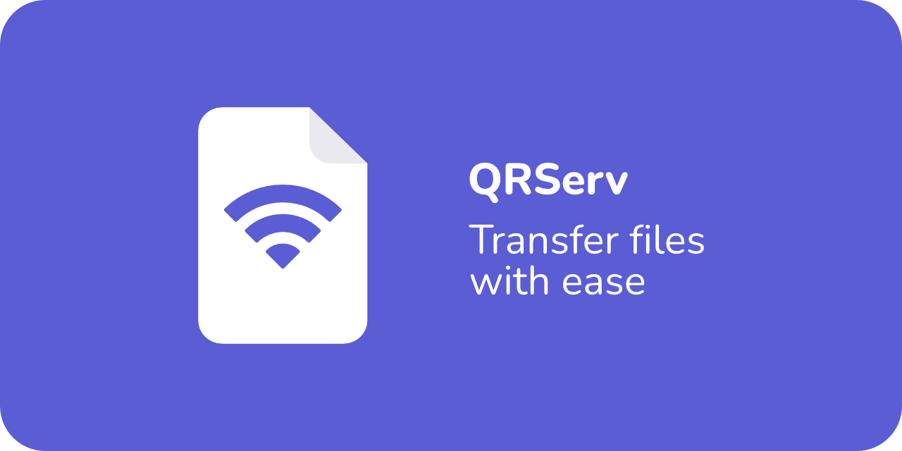
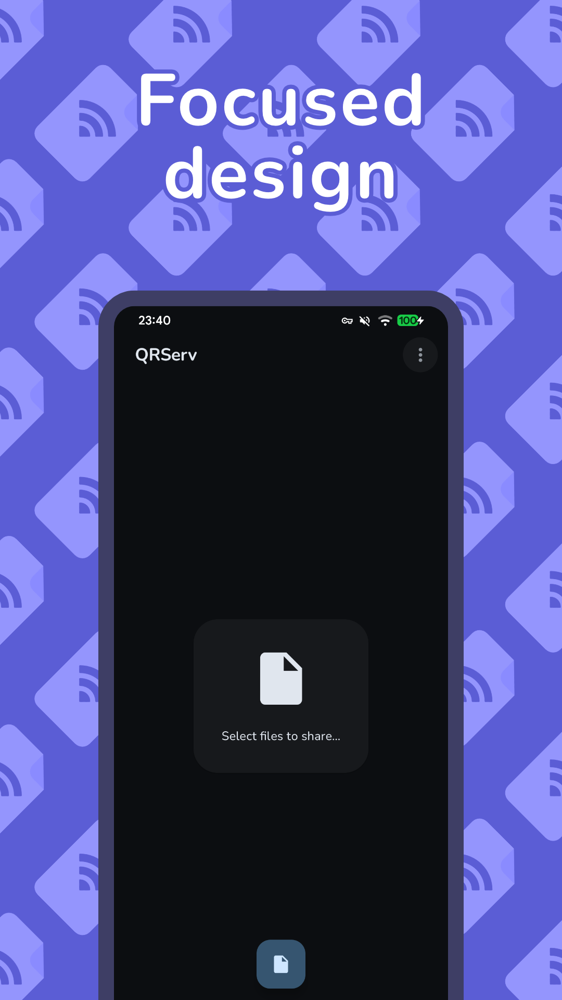
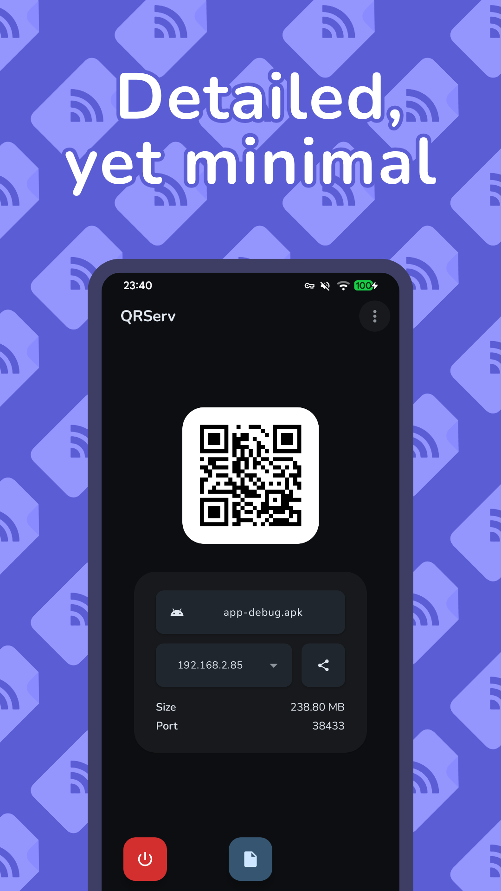
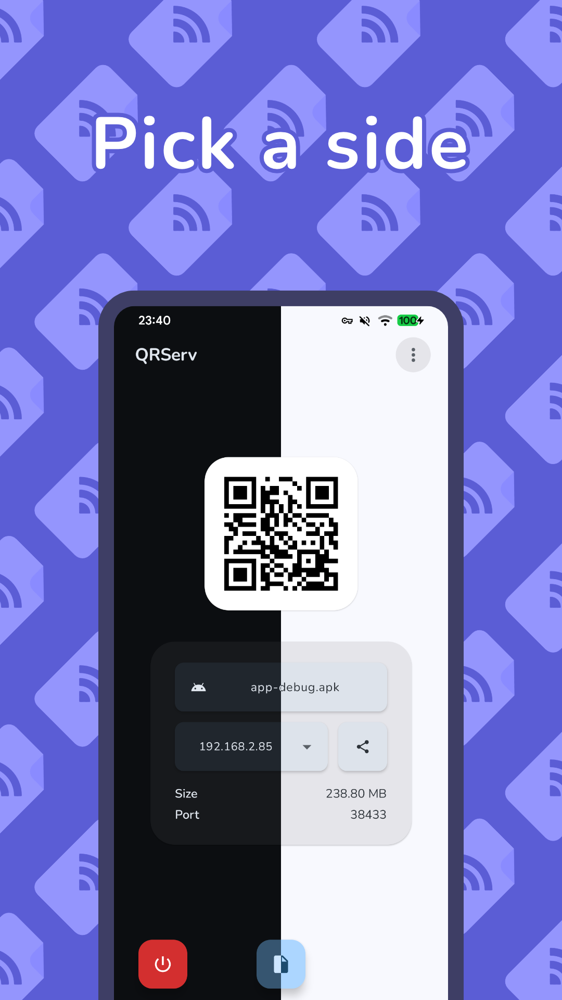
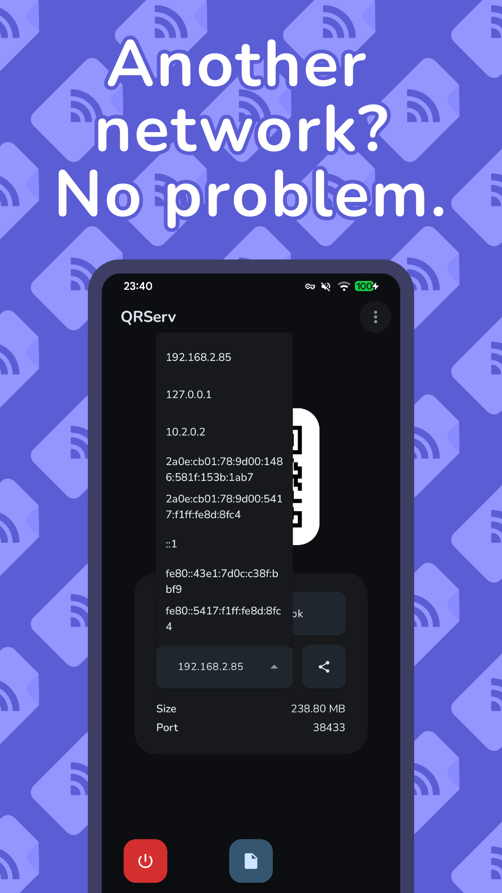
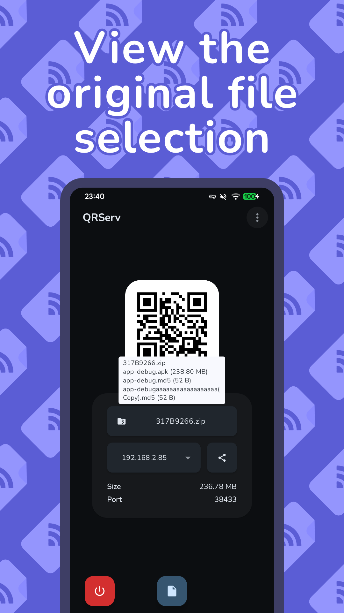
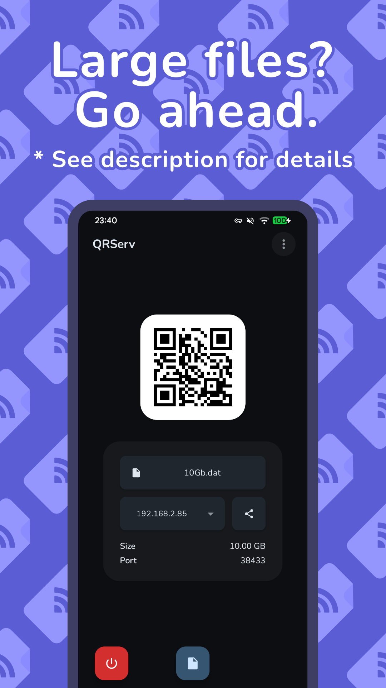

# QRServ

 

    Transfer files with ease over a network.
     
     
    
    &nbsp;&nbsp;
    

    
    &nbsp;&nbsp;&nbsp;&nbsp;
    

    

 

    
Screenshots

     
    

        
        
        
        
        
        
    

 

## About

QRServ is a file sharing application that utilizes its own HTTP server to serve files while having a clean & functional user interface.

The app is a native Android app written in Kotlin with Jetpack Compose. Prior to v4.0.0, it was built with Flutter/Dart.

## Features

- QR Code
  - Tap to show the URL in a tooltip
  - Press and hold to copy the URL to the clipboard
- Share sheet
  - Share the download URL via the system share sheet
  - Import files via the system share sheet from other apps
  - Sharing text with the app creates a text file to share
- Shows live import progress, whether for a single file or multiple
- Multi-file selection
  - Bundled into a ZIP archive
  - Press and hold the archive's filename to see the originally selected files in a tooltip
- Direct Access Mode -- serves the file directly from storage instead of copying it into app cache first, ideal for large files
  - Single file selection only
  - Always available on the GitHub release; Play Store builds only support it on Android 10 or earlier (see [Play Store and GitHub version differences](#play-store-and-github-version-differences))
  - Toggleable in settings
- Detects if the selected file is removed while being served, or modified (Direct Access Mode only)
- Show or hide the filename in the download URL
- Notifies when a client requests or finishes downloading the file, including their IP address
- Choose which network interface's IP address to serve from
- HTTP server binds to a random free port by default, or a user-configured one
- In-app theme selection
- Supports various languages:
  - English
  - French (Français)
  - German (Deutsch)
  - Hungarian (Magyar)
  - Italian (Italiano)
  - Polish (Polski)
  - Portuguese (Português)
  - Spanish (Español)
  - Russian (Русский)
  - Turkish (Türkçe)
  - Persian (فارسی)
  - Hebrew (עברית)

## System Requirements

- **System:** Android
- **Minimum version:** 7.0

## Releases

Releases can be found in the [releases](../../releases) section of this repository.

Note: Android builds on GitHub will have a different certificate than builds on the Play Store. In other words, you cannot upgrade a build from installation source A via source B, and vice versa.

### Play Store and GitHub version differences

As you may be aware, there are two different Android builds of this application. This section will cover the differences.

#### Play Store

- Direct Access Mode is **not** available for Android 11 or later due to the `MANAGE_EXTERNAL_STORAGE` runtime permission requirement (see issue #20).
  - In short, Google Play became far stricter about the usage of such sensitive permissions in June 2024.
  - The MediaStore API has its own limitations for this use case that would require a substantial amount of custom implementation to work around.

#### GitHub

- Direct Access Mode **is** available for all supported Android versions, as `MANAGE_EXTERNAL_STORAGE` can be used to allow support for Android 11 or later.

#### Changing build types

By default, the source code builds the GitHub version. The version used for the Play Store uses the build command `./gradlew bundleRelease -PNO_MES=true` so that the `MANAGE_EXTERNAL_STORAGE` permission gets patched out and the build would be accepted.

### Desktop

The last desktop builds (Windows, Linux) can be found in the [releases section under v1.1.1](../../releases/tag/v1.1.1). These predate the Kotlin rewrite and can no longer be built from the current source, which targets Android only.

## Contributing

If you are considering contributing to QRServ or reporting issues, more information can be [found here](CONTRIBUTING.md).

## Building

Ensure you have the Android NDK installed to build a release variant. You may need to specify `ndk.dir` in the `local.properties` file.
 
The NDK is used by the `no-build-id` plugin (see `noBuildId.ndkDirectory` in the [app Gradle build file](app/build.gradle.kts)) to strip `.note.gnu.build-id` from native libraries for reproducible builds. If you do not need this, you can remove that plugin block.

## Licenses

Google Play and the Google Play logo are trademarks of Google LLC.

Nunito (the font) is licensed under [OFL-1.1](app/src/main/res/raw/nunito_ofl.txt).

QRServ is licensed under the [MIT license](LICENSE).

## Translations and translators

New and existing translations are very welcome via issue, pull request, or even email. Credit will be given unless opted out.

Thanks to the following users for helping with language translation:

| User                                         | Language(s) |
| -------------------------------------------- | ----------- |
| [miklosakos](https://github.com/miklosakos)  | Hungarian   |
| [MrRocketFX](https://twitter.com/MrRocketFX) | Polish      |
| [utf-4096](https://github.com/utf-4096)      | French      |
| [SimoneG97](https://github.com/SimoneG97)    | Italian     |
| [guidov2006](https://github.com/guidov2006)  | Spanish     |
| [SapphicMoe](https://github.com/SapphicMoe)  | Russian     |
| [metezd](https://github.com/metezd)          | Turkish     |
| princessmortix                               | Portuguese  |
| [alr86](https://github.com/alr86)            | Persian     |
| [vhhhl](https://github.com/vhhhl)            | German      |
| [elid34](https://github.com/elid34)          | Hebrew      |
