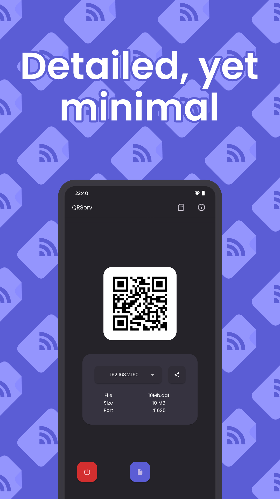
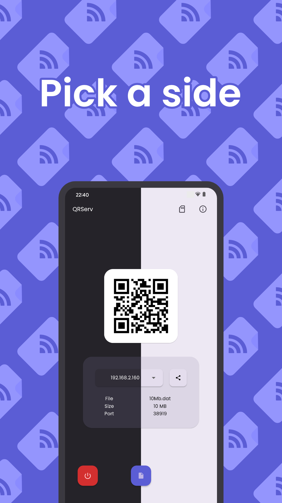
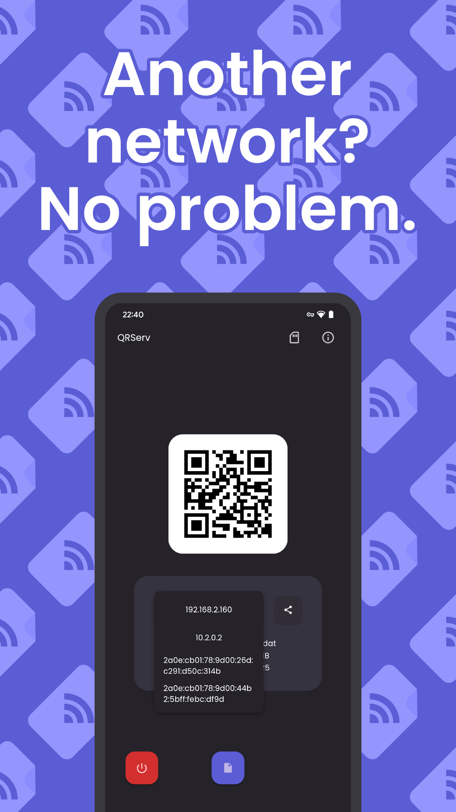
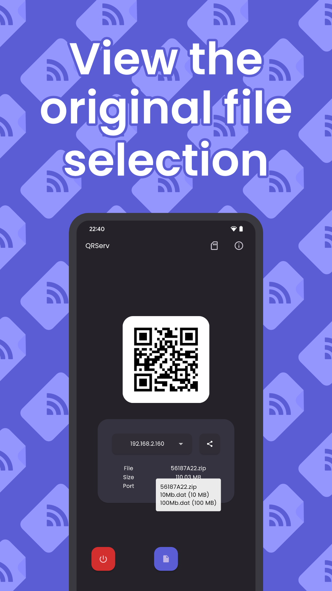
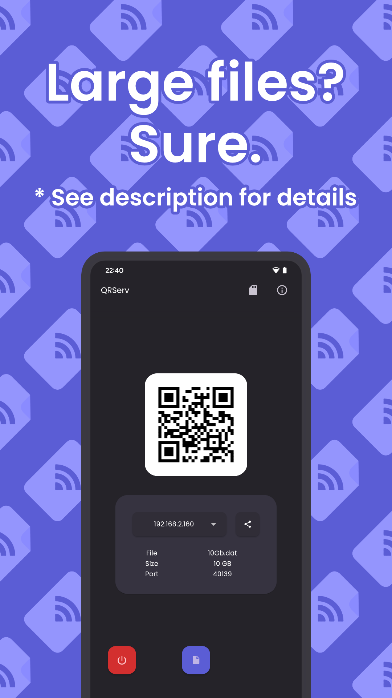

# QRServ

 

    Transfer files with ease over a network.
     
     
    
    &nbsp;&nbsp;
    
     
     
    
    &nbsp;&nbsp;&nbsp;&nbsp;
    

 

    
Screenshots

     
    

        
        &nbsp;&nbsp;
        
        &nbsp;&nbsp;
        
        &nbsp;&nbsp;
        
        &nbsp;&nbsp;
        
        &nbsp;&nbsp;
        
    

 

## About

QRServ is a file sharing application that utilises its own HTTP server to serve files while having a clean & functional user interface.

## Features

-   QR Code
-   Share / Copy to clipboard option
-   Multi-file selection support (Android only)
    -   Multi-file selection would result in a ZIP archive
        -   Tooltip when press and holding on the resulting archive file name will reveal the originally selected files
-   Direct access mode (Android only)
    -   Large files? Use direct access mode to use direct access to internal storage as to avoid attempting to copy the selection into app cache
    -   The file manager for this mode only supports single file selection
    -   The mode can be toggled by pressing on the SD card icon
-   File selection removal and modification detection
-   Import via sharesheet (Android only)
-   Show and hide filename in download URL path
    -   Long press the share button to toggle
-   Various IP addresses from different network interfaces can be chosen
-   HTTP server uses an unused ("random") port
-   Supports Android, Windows and Linux platforms
-   Supports various languages:
    -   English
    -   French (Français)
    -   German (Deutsch)
    -   Hungarian (Magyar)
    -   Italian (Italiano)
    -   Polish (Polski)
    -   Portuguese (Português)
    -   Spanish (Español)
    -   Russian (Русский)
    -   Turkish (Türkçe)

## Releases

Android builds can be found in the [releases](../../releases) section of this repository.

Last desktop builds (Windows, Linux) can be found in the [releases section under v1.1.1](../../releases/tag/v1.1.1).

Note: Android builds on GitHub will have a different certificate than builds on the Play Store. In other words, you cannot upgrade a build from installation source A via source B and vice versa.

## Contributing

Before creating a new issue or putting together a pull request (particularly regarding feature requests or potential improvements), please refer to the [design philosophy](PHILOSOPHY.md). It also serves as a Q&A.

## Building

### Android

If you wish to have debugging symbols for an app bundle release, ensure you have the Android NDK installed. You may need to specify the `ndk.dir` in the `local.properties` file.
 
However, if you do not plan to do a Play Store release, you may remove the `ndk` block from `android.defaultConfig` in the gradle build file.

### Windows

Windows builds normally require `Visual C++ Redistributable for Visual Studio 2015` to run. There are two ways you could go about it:

1. Install [Visual C++ Redistributable for Visual Studio 2015](https://www.microsoft.com/en-us/download/details.aspx?id=48145)
2. Bundle the required files in the root directory of the compiled executable (`msvcp140.dll`, `vcruntime140.dll`, `vcruntime140_1.dll`) -- ideal when distributing

You could [package builds as a MSIX](https://pub.dev/packages/msix) but that is only practical if you plan to get or already have a code signing certificate.

## Licencing

Google Play and the Google Play logo are trademarks of Google LLC.

Poppins (the font) is licenced under [OFL-1.1](fonts/OFL.txt).

QRServ is licenced under the [MIT license](LICENSE).

## Translations and translators

New and existing translations are very welcome. Via issue, pull request, or even email. Credit will be given unless opted out.

Thanks to the following users for helping out with language translation:

| User                                           | Language(s) |
| ---------------------------------------------- | ----------- |
| [miklosakos](https://github.com/miklosakos)    | Hungarian   |
| [MrRocketFX](https://twitter.com/MrRocketFX)   | Polish      |
| [utf-4096](https://github.com/utf-4096)        | French      |
| [SimoneG97](https://github.com/SimoneG97)      | Italian     |
| [guidov2006](https://github.com/guidov2006)    | Spanish     |
| [solelychloe](https://arciniega.one)           | Russian     |
| [metezd](https://github.com/metezd)            | Turkish     |
| [princessmortix](https://princessmortix.link/) | Portuguese  |
